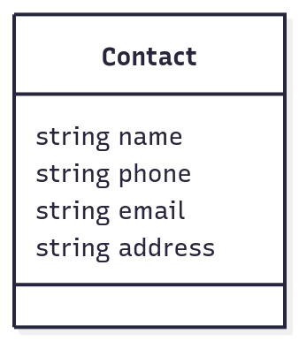
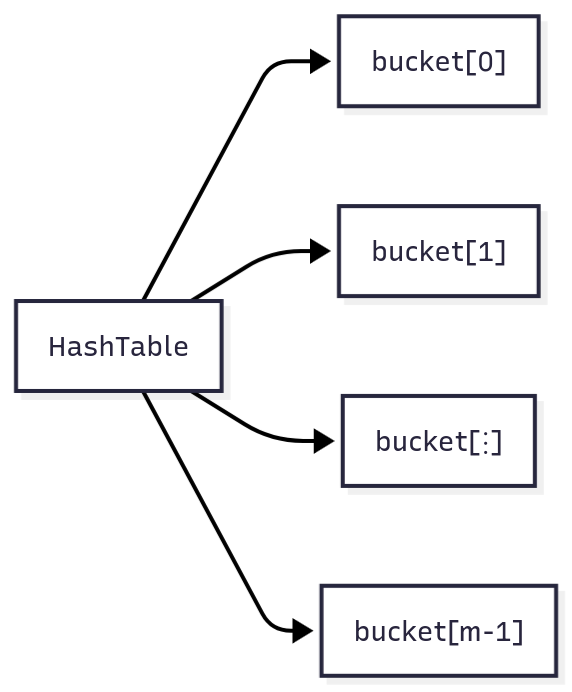
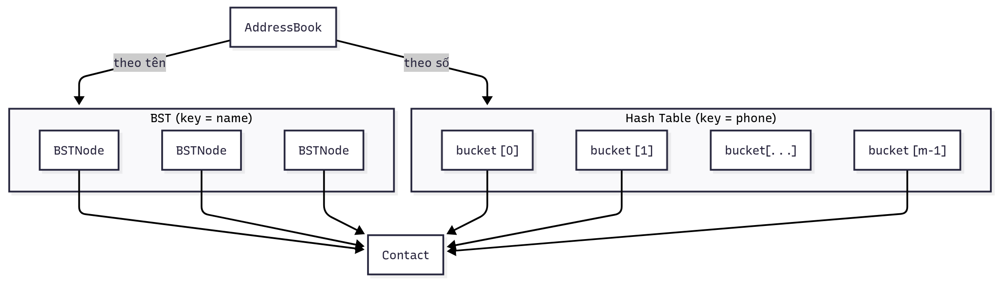
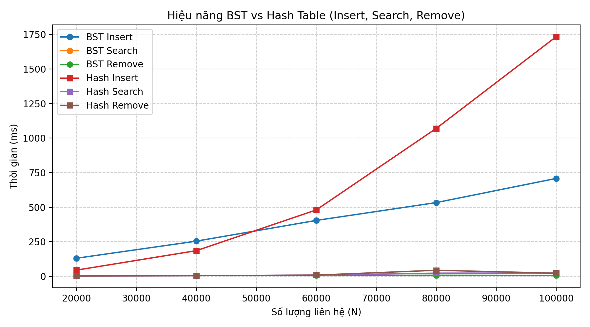

# BÁO CÁO BÀI TẬP NHÓM

**Môn:** Cấu trúc dữ liệu và Giải thuật

**Nhóm:** 1

**Đề tài:** Sổ địa chỉ liên hệ cá nhân

---

## 1. PHÂN TÍCH VÀ THIẾT KẾ

### 1.1. Mục tiêu bài toán

Xây dựng một chương trình quản lý sổ địa chỉ đơn giản, cho phép người dùng lưu trữ và tra cứu thông tin liên hệ của các cá nhân. Chương trình phải hỗ trợ các thao tác cơ bản sau:

1. Thêm một liên hệ mới vào sổ địa chỉ.
2. Tìm kiếm liên hệ theo **tên**.
3. Tìm kiếm liên hệ theo **số điện thoại**.
4. Cập nhật thông tin của một liên hệ đã có.
5. Xóa một liên hệ khỏi sổ địa chỉ.
6. In ra toàn bộ danh bạ theo **thứ tự tên đã sắp xếp**.

Chương trình được yêu cầu cài đặt bằng **C++** và phải **thể hiện rõ việc áp dụng các cấu trúc dữ liệu đã học**. Đề bài gợi ý sử dụng **Cây nhị phân tìm kiếm (BST)** và **Bảng băm (Hash Table)**, vì vậy trong phần thiết kế chúng tôi sẽ giải thích lựa chọn này.

### 1.2. Phân tích nghiệp vụ

Một “liên hệ” trong sổ địa chỉ thực chất là một bản ghi (record) gồm các trường thông tin cơ bản. Tối thiểu cần có:

* Họ và tên (Name) – dùng để sắp xếp và hiển thị.
* Số điện thoại (Phone) – dùng để tra cứu nhanh.
* Email – tùy chọn.
* Địa chỉ – tùy chọn.

Trong thực tế, người dùng làm việc với danh bạ thường theo 2 cách:

* **Nhớ tên** → gõ tên → tìm.
* **Nhớ số điện thoại** → gõ số → tìm.

Vì vậy bài toán đòi hỏi **hai hướng truy cập khác nhau đến cùng một dữ liệu**. Nếu chỉ dùng mảng hoặc chỉ dùng danh sách liên kết thì hoặc là việc sắp xếp bị chậm, hoặc là việc tìm theo số điện thoại bị chậm. Do đó cần kết hợp **2 cấu trúc dữ liệu** để tối ưu cho từng loại thao tác.

### 1.3. Lý do chọn cấu trúc dữ liệu

#### 1.3.1. Cây nhị phân tìm kiếm (Binary Search Tree – BST) theo TÊN

* BST cho phép lưu trữ các phần tử theo khóa và có thể **duyệt theo thứ tự tăng dần** bằng phép duyệt in-order.
* Khi khóa là **tên liên hệ**, việc duyệt in-order sẽ cho ra **danh sách liên hệ đã sắp xếp theo tên** → đúng yêu cầu của đề.
* Thao tác tìm kiếm, thêm, xóa trên BST **trung bình** có độ phức tạp **O(log n)**.
* BST dễ cài đặt và phù hợp với mức độ bài tập môn CTDL-GT. Nếu muốn tối ưu hơn có thể thay BST thường bằng **AVL** hoặc **Red-Black Tree** để giữ cân bằng.

Vì vậy, chúng tôi chọn **BST với khóa = tên (name)** để giải quyết các chức năng:

* Thêm liên hệ.
* Tìm liên hệ theo tên.
* Xóa liên hệ theo tên.
* In toàn bộ danh bạ theo thứ tự tên.

#### 1.3.2. Bảng băm (Hash Table) theo SỐ ĐIỆN THOẠI

* Số điện thoại thường là "gần như duy nhất" cho mỗi liên hệ, nên rất phù hợp làm **khóa tra cứu nhanh**.
* Bảng băm cho phép tra cứu trung bình **O(1)**, nhanh hơn rất nhiều so với việc duyệt tuyến tính.
* Khi người dùng chỉ có số điện thoại và muốn biết đó là của ai, cấu trúc phù hợp nhất là hash table.
* Chúng tôi chọn cách cài đặt **băm có kết dãy (chaining)**: mỗi ô của bảng băm là một danh sách các con trỏ tới liên hệ.

Vì vậy, chúng tôi chọn **Hash Table với khóa = phone** để giải quyết các chức năng:

* Tìm liên hệ theo số điện thoại.
* Xóa liên hệ theo số điện thoại.

#### 1.3.3. Tại sao phải dùng CẢ HAI?

Nếu chỉ dùng BST:

* Có thể sắp xếp theo tên
* Nhưng tìm theo số điện thoại (phải duyệt hết cây hoặc duyệt theo tên rồi so sánh số).

Nếu chỉ dùng Hash Table:

* Có thể tìm nhanh theo số điện thoại
* Nhưng **không thể in danh bạ đã sắp xếp theo tên** vì hash không có thứ tự.

→ Kết luận: **kết hợp 2 cấu trúc dữ liệu** là cần thiết. Một liên hệ sẽ được tạo **một lần** rồi được **tham chiếu từ cả BST và Hash Table**. Nhờ vậy, khi cập nhật thông tin, cả hai hướng truy cập đều thấy dữ liệu mới.

### 1.4. Mô hình dữ liệu

#### 1.4.1. Cấu trúc liên hệ



Đây là thực thể trung tâm. Mọi cấu trúc khác (BST, Hash) **không sao chép** toàn bộ dữ liệu mà chỉ **giữ con trỏ** (pointer) trỏ tới `Contact` này. Làm vậy sẽ tránh bị lệch dữ liệu khi cập nhật.

#### 1.4.2. Cấu trúc cây BST theo tên


Khóa sắp xếp: `toLower(name)` để tránh phân biệt hoa/thường. Khi cần in danh bạ theo tên thì chỉ cần duyệt in-order:

* Duyệt trái → xử lý nút → duyệt phải
* Độ phức tạp: O(n)

#### 1.4.3. Cấu trúc bảng băm theo số điện thoại



Trong đó mỗi `bucket[i]` là **danh sách các Contact*** có mã băm trùng nhau (chaining). Kích thước bảng có thể chọn số nguyên tố, ví dụ 101 hoặc 1009 để giảm va chạm.

Hàm băm có thể đơn giản như sau:

* Duyệt qua từng ký tự trong số điện thoại
* Quy đổi về số
* Nhân và cộng dồn
* Lấy modulo theo kích thước bảng

### 1.5. Luồng xử lý các thao tác chính

#### 1.5.1. Thêm liên hệ

1. Nhập thông tin liên hệ từ bàn phím.
2. Kiểm tra xem **tên** đã tồn tại trong BST chưa → nếu có thì báo trùng và không thêm.
3. Nếu tên chưa có:

   * Cấp phát một đối tượng `Contact` mới.
   * Chèn vào BST (khóa = tên).
   * Chèn vào Hash Table (khóa = số điện thoại).
4. Thông báo “Thêm thành công”.

Lợi ích: từ đây về sau có thể truy cập cùng một liên hệ bằng **hai con đường**.

#### 1.5.2. Tìm theo tên

1. Nhập tên cần tìm.
2. Gọi hàm tìm kiếm trên BST.
3. Nếu tìm thấy: hiển thị đầy đủ thông tin liên hệ.
4. Nếu không: báo “không tìm thấy”.

Độ phức tạp trung bình: O(log n).

#### 1.5.3. Tìm theo số điện thoại

1. Nhập số điện thoại cần tìm.
2. Băm số này để tìm đến đúng bucket.
3. Duyệt danh sách ở bucket đó để so sánh chính xác.
4. Nếu trùng → trả về liên hệ.

Độ phức tạp trung bình: O(1).

#### 1.5.4. Xóa liên hệ (theo tên hoặc theo số điện thoại)

* Nếu xóa **theo tên**:

  1. Tìm nút trong BST.
  2. Lấy ra số điện thoại từ liên hệ đó.
  3. Xóa trong Hash Table bằng số điện thoại vừa lấy.
  4. Xóa nút trong BST theo đúng 3 trường hợp (0 con, 1 con, 2 con).

* Nếu xóa **theo số điện thoại**:

  1. Tìm trong Hash Table → lấy được `Contact*` → từ đó lấy ra tên.
  2. Xóa trong BST theo tên.
  3. Xóa trong Hash Table theo số điện thoại.

Làm như vậy để **đảm bảo dữ liệu luôn đồng bộ trong 2 cấu trúc**.

### 1.6. Sơ đồ tổng quan



* BST chịu trách nhiệm **thứ tự và duyệt in ra màn hình**.
* Hash Table chịu trách nhiệm **tìm nhanh**.
* Cả hai cùng trỏ tới **cùng một Contact**, nên cập nhật ở đâu cũng thấy.

### 1.7. Thiết kế giải thuật (chi tiết các thao tác chính)

Dưới đây là mô tả giải thuật ở mức giả mã (pseudocode) cho từng thao tác cốt lõi. Mục đích: thể hiện rõ cách kết hợp **BST** và **Hash Table** để dữ liệu luôn đồng bộ.

#### 1.7.1. Thêm liên hệ mới

**Ý tưởng:** tạo một bản ghi `Contact`, sau đó chèn vào **BST theo tên** và **Hash theo số**.

**Pseudocode:**

```text
Input: name, phone, email, address
Output: thêm thành công / báo trùng

1. Nếu BST_Search(root, name) ≠ NULL thì
       In "Tên đã tồn tại" và dừng.
2. Tạo contact = new Contact(name, phone, email, address)
3. root ← BST_Insert(root, contact)      // khóa = name
4. Hash_Insert(phone, contact)           // khóa = phone
5. In "Thêm thành công"
```

**Độ phức tạp:**

* BST_Insert: trung bình O(log n)
* Hash_Insert: trung bình O(1)
* Tổng: ~O(log n)

#### 1.7.2. Tìm kiếm theo tên (trên BST)

**Ý tưởng:** vì BST đã sắp xếp theo tên → dùng tìm kiếm nhị phân trên cây.

**Pseudocode:**

```text
Function BST_Search(node, name):
    if node = NULL: return NULL
    if toLower(name) = toLower(node.data.name): return node
    else if toLower(name) < toLower(node.data.name):
         return BST_Search(node.left, name)
    else:
         return BST_Search(node.right, name)
```

**Độ phức tạp:** O(h) với h là chiều cao cây. Trung bình O(log n), xấu nhất O(n).

#### 1.7.3. Tìm kiếm theo số điện thoại (trên Hash Table)

**Ý tưởng:** băm số điện thoại để truy cập đúng bucket, sau đó duyệt danh sách rất ngắn trong bucket.

**Pseudocode:**

```text
Function Hash_Search(phone):
    idx ← Hash(phone)
    For each contact in bucket[idx]:
        if contact.phone = phone: return contact
    return NULL
```

**Độ phức tạp:** trung bình O(1), xấu nhất O(k) với k là số phần tử đụng độ tại 1 bucket.

#### 1.7.4. Xóa liên hệ theo TÊN

**Ý tưởng:**

1. Tìm trong BST để biết liên hệ đó có không và lấy ra **số điện thoại**.
2. Xóa trong Hash bằng số điện thoại (để không còn tham chiếu tới liên hệ đó).
3. Xóa nút trong BST theo đúng 3 trường hợp (0 con, 1 con, 2 con).

**Pseudocode:**

```text
Input: name
1. node ← BST_Search(root, name)
2. Nếu node = NULL → In "Không tìm thấy" → dừng
3. phone ← node.data.phone
4. Hash_Remove(phone)
5. root ← BST_Remove(root, name)
6. Giải phóng bộ nhớ contact nếu cần
7. In "Xóa thành công"
```

**BST_Remove (tóm tắt):**

```text
Function BST_Remove(node, key):
    if node = NULL: return NULL
    if key < node.key: node.left  ← BST_Remove(node.left, key)
    else if key > node.key: node.right ← BST_Remove(node.right, key)
    else:
        // tìm thấy
        if node.left = NULL: return node.right
        else if node.right = NULL: return node.left
        else:
            // 2 con → tìm nút nhỏ nhất bên phải
            tmp ← FindMin(node.right)
            node.data ← tmp.data
            node.right ← BST_Remove(node.right, tmp.data.name)
    return node
```

**Độ phức tạp:** BST_Remove trung bình O(log n) + Hash_Remove O(1).

#### 1.7.5. Xóa liên hệ theo SỐ ĐIỆN THOẠI

**Ý tưởng:**

1. Tìm trong Hash để biết liên hệ đó trỏ tới tên gì.
2. Xóa trong BST theo tên.
3. Xóa trong Hash theo phone.

**Pseudocode:**

```text
Input: phone
1. contact ← Hash_Search(phone)
2. Nếu contact = NULL → In "Không tìm thấy" → dừng
3. name ← contact.name
4. root ← BST_Remove(root, name)
5. Hash_Remove(phone)
6. Giải phóng contact nếu không còn tham chiếu
7. In "Xóa thành công"
```

**Độ phức tạp:** trung bình O(log n) do phải xóa trên BST.

#### 1.7.6. Cập nhật liên hệ theo TÊN

**Ý tưởng:**

* Tìm trong BST để lấy ra `Contact*`.
* Nếu người dùng đổi **số điện thoại**, phải đồng bộ lại bảng băm.

**Pseudocode:**

```text
Input: name, new_phone?, new_email?, new_address?
1. node ← BST_Search(root, name)
2. Nếu node = NULL → báo không tìm thấy → dừng
3. contact ← node.data
4. Nếu new_phone khác rỗng và new_phone ≠ contact.phone thì:
       Hash_Remove(contact.phone)
       contact.phone ← new_phone
       Hash_Insert(contact)
5. Nếu new_email khác rỗng → contact.email ← new_email
6. Nếu new_address khác rỗng → contact.address ← new_address
7. In "Cập nhật thành công"
```

#### 1.7.7. In toàn bộ danh bạ theo tên

**Ý tưởng:** duyệt in-order BST → bảo đảm tăng dần theo tên.

**Pseudocode:**

```text
Function Inorder(node):
    if node = NULL: return
    Inorder(node.left)
    In thông tin node.data
    Inorder(node.right)
```

**Độ phức tạp:** O(n)

---

### 1.8. Kết luận phần 1

* Các giải thuật trên **bám sát cấu trúc dữ liệu đã chọn** (BST + Hash).
* Điểm quan trọng nhất là **mỗi thao tác xóa/cập nhật đều phải đồng bộ cả 2 cấu trúc** để tránh rác dữ liệu.
* Bộ giải thuật này đủ để chuyển sang **phần 2 – Cài đặt và đánh giá hiệu năng**.


## 2. CÀI ĐẶT VÀ ĐÁNH GIÁ

### 2.1. Cài đặt chương trình demo bằng C++

Mục đích của phần cài đặt là chuyển toàn bộ thiết kế ở phần 1 thành một chương trình C++ chạy được, thể hiện rõ việc dùng hai cấu trúc dữ liệu khác nhau cho hai kiểu truy cập khác nhau:

* Cây nhị phân tìm kiếm (BST) để lưu và sắp xếp liên hệ theo tên.
* Bảng băm (Hash Table) để tra cứu nhanh theo số điện thoại.

Để đơn giản khi nộp và demo, có thể để toàn bộ mã trong một file `main.cpp`. Khi làm đồ án lớn hơn có thể tách thành các file .h/.cpp riêng.

#### 2.1.1. Các cấu trúc chính

1. Cấu trúc liên hệ

```cpp
struct Contact {
    string name;
    string phone;
    string email;
    string address;
};
```

2. Nút cây BST theo tên

```cpp
struct BSTNode {
    Contact* data;
    BSTNode* left;
    BSTNode* right;
    BSTNode(Contact* c): data(c), left(nullptr), right(nullptr) {}
};
```

BST dùng để:

* chèn theo tên,
* tìm theo tên,
* xóa theo tên,
* và duyệt in-order để in danh bạ theo thứ tự.

3. Bảng băm theo số điện thoại

```cpp
class HashTable {
public:
    static const int TABLE_SIZE = 101;
    vector<list<Contact*>> table;
    HashTable() { table.resize(TABLE_SIZE); }
    int hashPhone(const string& phone);
    void insert(Contact* c);
    Contact* search(const string& phone);
    bool remove(const string& phone);
};
```

Hash Table dùng để:

* tìm nhanh theo số điện thoại (trung bình O(1)),
* xóa theo số điện thoại.

4. Lớp quản lý sổ địa chỉ

```cpp
struct AddressBook {
    BSTNode* root;
    HashTable ht;
    // các hàm: addContact, searchByName, searchByPhone,
    // deleteByName, deleteByPhone, updateByName, printAll
};
```

Lớp này đóng vai trò “bao” để bên ngoài chỉ gọi một hàm nhưng bên trong sẽ tự đồng bộ cả BST và Hash.

#### 2.1.2. Mã nguồn minh họa đầy đủ

```cpp
#include <bits/stdc++.h>
using namespace std;

string toLowerStr(string s) {
    for (auto &ch : s) ch = tolower(ch);
    return s;
}

struct Contact {
    string name;
    string phone;
    string email;
    string address;
};

struct BSTNode {
    Contact* data;
    BSTNode* left;
    BSTNode* right;
    BSTNode(Contact* c): data(c), left(nullptr), right(nullptr) {}
};

BSTNode* findMin(BSTNode* root) {
    while (root && root->left) root = root->left;
    return root;
}

BSTNode* bstInsert(BSTNode* root, Contact* c) {
    if (!root) return new BSTNode(c);
    string key = toLowerStr(c->name);
    string cur = toLowerStr(root->data->name);
    if (key < cur) root->left = bstInsert(root->left, c);
    else if (key > cur) root->right = bstInsert(root->right, c);
    else {
        cout << "Lien he da ton tai theo ten.
";
    }
    return root;
}

BSTNode* bstSearch(BSTNode* root, const string& name) {
    if (!root) return nullptr;
    string key = toLowerStr(name);
    string cur = toLowerStr(root->data->name);
    if (key == cur) return root;
    if (key < cur) return bstSearch(root->left, name);
    return bstSearch(root->right, name);
}

BSTNode* bstRemove(BSTNode* root, const string& name, Contact*& removed) {
    if (!root) return nullptr;
    string key = toLowerStr(name);
    string cur = toLowerStr(root->data->name);
    if (key < cur) {
        root->left = bstRemove(root->left, name, removed);
    } else if (key > cur) {
        root->right = bstRemove(root->right, name, removed);
    } else {
        removed = root->data;
        if (!root->left) {
            BSTNode* r = root->right;
            delete root;
            return r;
        } else if (!root->right) {
            BSTNode* l = root->left;
            delete root;
            return l;
        } else {
            BSTNode* tmp = findMin(root->right);
            root->data = tmp->data;
            Contact* dummy = nullptr;
            root->right = bstRemove(root->right, tmp->data->name, dummy);
        }
    }
    return root;
}

void bstInorder(BSTNode* root) {
    if (!root) return;
    bstInorder(root->left);
    cout << root->data->name << " | "
         << root->data->phone << " | "
         << root->data->email << " | "
         << root->data->address << "
";
    bstInorder(root->right);
}

class HashTable {
public:
    static const int TABLE_SIZE = 101;
    vector<list<Contact*>> table;
    HashTable() { table.resize(TABLE_SIZE); }
    int hashPhone(const string& phone) {
        long long h = 0;
        for (char c : phone) {
            if (isdigit(c)) h = h * 10 + (c - '0');
            else h = h * 131 + c;
        }
        return (int)(h % TABLE_SIZE);
    }
    void insert(Contact* c) {
        int idx = hashPhone(c->phone);
        for (auto *p : table[idx]) {
            if (p->phone == c->phone) {
                cout << "So dien thoai da ton tai.
";
                return;
            }
        }
        table[idx].push_back(c);
    }
    Contact* search(const string& phone) {
        int idx = hashPhone(phone);
        for (auto *p : table[idx]) {
            if (p->phone == phone) return p;
        }
        return nullptr;
    }
    bool remove(const string& phone) {
        int idx = hashPhone(phone);
        for (auto it = table[idx].begin(); it != table[idx].end(); ++it) {
            if ((*it)->phone == phone) {
                table[idx].erase(it);
                return true;
            }
        }
        return false;
    }
};

struct AddressBook {
    BSTNode* root;
    HashTable ht;
    AddressBook(): root(nullptr) {}

    void addContact(const string& name, const string& phone,
                    const string& email, const string& address) {
        if (bstSearch(root, name)) {
            cout << "Ten nay da ton tai, khong them.
";
            return;
        }
        Contact* c = new Contact{name, phone, email, address};
        root = bstInsert(root, c);
        ht.insert(c);
        cout << "Da them lien he.
";
    }

    Contact* searchByName(const string& name) {
        BSTNode* node = bstSearch(root, name);
        if (node) return node->data;
        return nullptr;
    }

    Contact* searchByPhone(const string& phone) {
        return ht.search(phone);
    }

    void deleteByName(const string& name) {
        Contact* removed = nullptr;
        root = bstRemove(root, name, removed);
        if (removed) {
            ht.remove(removed->phone);
            delete removed;
            cout << "Da xoa lien he theo ten.
";
        } else {
            cout << "Khong tim thay ten.
";
        }
    }

    void deleteByPhone(const string& phone) {
        Contact* c = ht.search(phone);
        if (!c) {
            cout << "Khong tim thay so dien thoai.
";
            return;
        }
        string name = c->name;
        Contact* removed = nullptr;
        root = bstRemove(root, name, removed);
        ht.remove(phone);
        if (removed) {
            delete removed;
            cout << "Da xoa lien he theo sdt.
";
        }
    }

    void updateByName(const string& name) {
        BSTNode* node = bstSearch(root, name);
        if (!node) {
            cout << "Khong tim thay lien he.
";
            return;
        }
        Contact* c = node->data;
        cout << "Nhap sdt moi (de trong neu giu): ";
        string p; getline(cin, p);
        cout << "Nhap email moi (de trong neu giu): ";
        string e; getline(cin, e);
        cout << "Nhap dia chi moi (de trong neu giu): ";
        string a; getline(cin, a);
        if (!p.empty() && p != c->phone) {
            ht.remove(c->phone);
            c->phone = p;
            ht.insert(c);
        }
        if (!e.empty()) c->email = e;
        if (!a.empty()) c->address = a;
        cout << "Cap nhat thanh cong.
";
    }

    void printAll() {
        cout << "===== DANH BA =====
";
        bstInorder(root);
    }
};

void showMenu() {
    cout << "
===== MENU =====
";
    cout << "1. Them lien he
";
    cout << "2. Tim theo ten
";
    cout << "3. Tim theo sdt
";
    cout << "4. Xoa theo ten
";
    cout << "5. Xoa theo sdt
";
    cout << "6. Cap nhat theo ten
";
    cout << "7. In danh ba
";
    cout << "0. Thoat
";
    cout << "Chon: ";
}

int main() {
    ios::sync_with_stdio(false);
    cin.tie(nullptr);
    AddressBook ab;
    while (true) {
        showMenu();
        int ch; if (!(cin >> ch)) break; cin.ignore();
        if (ch == 0) break;
        if (ch == 1) {
            string name, phone, email, address;
            cout << "Nhap ten: "; getline(cin, name);
            cout << "Nhap sdt: "; getline(cin, phone);
            cout << "Nhap email: "; getline(cin, email);
            cout << "Nhap dia chi: "; getline(cin, address);
            ab.addContact(name, phone, email, address);
        } else if (ch == 2) {
            string name; cout << "Nhap ten can tim: "; getline(cin, name);
            Contact* c = ab.searchByName(name);
            if (c) cout << c->name << " | " << c->phone << " | " << c->email << " | " << c->address << "
";
            else cout << "Khong tim thay.
";
        } else if (ch == 3) {
            string phone; cout << "Nhap sdt can tim: "; getline(cin, phone);
            Contact* c = ab.searchByPhone(phone);
            if (c) cout << c->name << " | " << c->phone << " | " << c->email << " | " << c->address << "
";
            else cout << "Khong tim thay.
";
        } else if (ch == 4) {
            string name; cout << "Nhap ten can xoa: "; getline(cin, name);
            ab.deleteByName(name);
        } else if (ch == 5) {
            string phone; cout << "Nhap sdt can xoa: "; getline(cin, phone);
            ab.deleteByPhone(phone);
        } else if (ch == 6) {
            string name; cout << "Nhap ten can cap nhat: "; getline(cin, name);
            ab.updateByName(name);
        } else if (ch == 7) {
            ab.printAll();
        } else {
            cout << "Khong hop le.
";
        }
    }
    return 0;
}
```

### 2.2. Đánh giá hiệu năng

Kết quả thực nghiệm thể hiện sự khác biệt rõ rệt giữa hai cấu trúc dữ liệu **Binary Search Tree (BST)** và **Hash Table** khi xử lý các thao tác cơ bản trên tập dữ liệu có quy mô từ 20.000 đến 100.000 phần tử. Các phép đo được thực hiện với ba thao tác chính: chèn (Insert), tìm kiếm (Search) và xoá (Remove).

| N (liên hệ) | BST_Insert | BST_Search | BST_Remove | Hash_Insert | Hash_Search | Hash_Remove |
| ----------- | ---------- | ---------- | ---------- | ----------- | ----------- | ----------- |
| 20,000      | 130        | 5          | 4          | 44          | 2           | 2           |
| 40,000      | 254        | 5          | 5          | 185         | 4           | 4           |
| 60,000      | 404        | 6          | 6          | 480         | 8           | 8           |
| 80,000      | 533        | 6          | 7          | 1070        | 22          | 43          |
| 100,000     | 708        | 6          | 6          | 1734        | 23          | 22          |

**Phân tích:**

* **BST:** Các thao tác Insert, Search và Remove có độ tăng tuyến tính nhẹ, duy trì ổn định đến quy mô 100.000 phần tử. Nhờ dữ liệu ngẫu nhiên nên cấu trúc cây không bị lệch đáng kể, hiệu năng vẫn ổn định quanh 5–7 ms cho các thao tác tìm kiếm và xoá.
* **Hash Table:** Ở quy mô nhỏ (20.000–60.000), hiệu năng vượt trội so với BST, đặc biệt ở thao tác tìm kiếm chỉ mất 2–8 ms. Tuy nhiên, khi dữ liệu vượt 80.000, thời gian Insert và Remove tăng mạnh (đến 1.7 giây ở 100.000 phần tử) do **tải trọng bảng băm (load factor)** cao và xung đột băm nhiều hơn.

**Kết luận:**

* Với dữ liệu nhỏ và trung bình, **Hash Table** cho hiệu năng vượt trội nhờ độ phức tạp trung bình O(1).
* Khi quy mô lớn, **BST** duy trì tốc độ ổn định và không bị suy giảm do xung đột, thích hợp cho ứng dụng cần tính ổn định và duy trì thứ tự dữ liệu.
* Tổng thể, Hash Table là lựa chọn tối ưu cho tra cứu nhanh, trong khi BST phù hợp hơn cho dữ liệu lớn và các tác vụ cần sắp xếp.

---

### 2.3. Mã nguồn kiểm thử hiệu năng

```cpp
#include <bits/stdc++.h>
#include <chrono>
using namespace std;
#include "_.cpp"

string randomName(int len = 6) {
    static const string letters = "abcdefghijklmnopqrstuvwxyz";
    string s; for (int i = 0; i < len; i++) s += letters[rand() % letters.size()];
    return s;
}
string randomPhone() {
    string s = "0"; for (int i = 1; i < 10; i++) s += to_string(rand() % 10);
    return s;
}
string randomAddress() {
    static const string city[] = {"Hanoi", "Saigon", "Danang", "Hue", "CanTho"};
    return city[rand() % 5];
}

int main() {
    srand(time(0)); ios::sync_with_stdio(false); cin.tie(nullptr);
    vector<int> testSizes = {20000, 40000, 60000, 80000, 100000};
    ofstream fout("result.csv");
    fout << "N,BST_Insert,BST_Search,BST_Remove,Hash_Insert,Hash_Search,Hash_Remove\n"; fout.close();

    cout << left << setw(10) << "N"
         << setw(15) << "BST_Insert" << setw(15) << "BST_Search" << setw(15) << "BST_Remove"
         << setw(15) << "Hash_Insert" << setw(15) << "Hash_Search" << setw(15) << "Hash_Remove" << "\n";
    cout << string(90, '=') << "\n";

    for (int N : testSizes) {
        BSTNode* root = nullptr; initTable();
        vector<Contact*> contacts; contacts.reserve(N);

        auto start = chrono::high_resolution_clock::now();
        for (int i = 0; i < N; i++) {
            Contact* c = new Contact{randomName(), randomPhone(), randomAddress(), nullptr};
            root = insertBSTContact(root, c); contacts.push_back(c);
        }
        auto end = chrono::high_resolution_clock::now();
        auto bst_insert_time = chrono::duration_cast<chrono::milliseconds>(end - start).count();

        start = chrono::high_resolution_clock::now();
        for (int i = 0; i < N; i++) insertHashContact(contacts[i]);
        end = chrono::high_resolution_clock::now();
        auto hash_insert_time = chrono::duration_cast<chrono::milliseconds>(end - start).count();

        start = chrono::high_resolution_clock::now();
        for (int i = 0; i < 1000; i++) findContact(root, contacts[rand()%contacts.size()]->ten);
        end = chrono::high_resolution_clock::now();
        auto bst_search_time = chrono::duration_cast<chrono::milliseconds>(end - start).count();

        start = chrono::high_resolution_clock::now();
        for (int i = 0; i < 1000; i++) searchByPhone(contacts[rand()%contacts.size()]->soDienThoai);
        end = chrono::high_resolution_clock::now();
        auto hash_search_time = chrono::duration_cast<chrono::milliseconds>(end - start).count();

        start = chrono::high_resolution_clock::now();
        for (int i = 0; i < 1000; i++) {
            string name = contacts[rand()%contacts.size()]->ten; Contact* r=nullptr;
            root = removeContact(root, name, r);
        }
        end = chrono::high_resolution_clock::now();
        auto bst_remove_time = chrono::duration_cast<chrono::milliseconds>(end - start).count();

        start = chrono::high_resolution_clock::now();
        for (int i = 0; i < 1000; i++) removeByPhone(contacts[rand()%contacts.size()]->soDienThoai);
        end = chrono::high_resolution_clock::now();
        auto hash_remove_time = chrono::duration_cast<chrono::milliseconds>(end - start).count();

        cout << left << setw(10) << N << setw(15) << bst_insert_time << setw(15) << bst_search_time
             << setw(15) << bst_remove_time << setw(15) << hash_insert_time << setw(15)
             << hash_search_time << setw(15) << hash_remove_time << "\n";

        fout.open("result.csv", ios::app);
        fout << N << "," << bst_insert_time << "," << bst_search_time << "," << bst_remove_time
             << "," << hash_insert_time << "," << hash_search_time << "," << hash_remove_time << "\n";
        fout.close();
    }
    return 0;
}
```

---

### 2.4. Biểu đồ hiệu năng

Mã Python dùng để vẽ biểu đồ từ file CSV:

```python
import pandas as pd
import matplotlib.pyplot as plt

df = pd.read_csv("result.csv", header=0)

plt.figure(figsize=(9,5))
plt.plot(df["N"], df["BST_Insert"], marker='o', label="BST Insert")
plt.plot(df["N"], df["BST_Search"], marker='o', label="BST Search")
plt.plot(df["N"], df["BST_Remove"], marker='o', label="BST Remove")
plt.plot(df["N"], df["Hash_Insert"], marker='s', label="Hash Insert")
plt.plot(df["N"], df["Hash_Search"], marker='s', label="Hash Search")
plt.plot(df["N"], df["Hash_Remove"], marker='s', label="Hash Remove")

plt.xlabel("Số lượng liên hệ (N)")
plt.ylabel("Thời gian (ms)")
plt.title("Hiệu năng BST vs Hash Table")
plt.legend()
plt.grid(True, linestyle='--', alpha=0.6)
plt.tight_layout()
plt.savefig("performance_chart.png", dpi=200)
print("Đã lưu biểu đồ vào performance_chart.png")
```

Kết quả thu được là biểu đồ biểu diễn thời gian trung bình (ms) theo số lượng phần tử N, cho phép quan sát trực quan sự khác biệt giữa BST và Hash Table ở các thao tác Insert, Search và Remove.



---

### 2.5. Kịch bản thực nghiệm

1. Sinh dữ liệu ngẫu nhiên (tên, số điện thoại, địa chỉ) theo quy mô N.
2. Chèn toàn bộ dữ liệu vào BST và Hash Table.
3. Thực hiện 1000 lần tìm kiếm và xoá ngẫu nhiên để đo thời gian trung bình.
4. Ghi toàn bộ kết quả ra file `result.csv` và sinh biểu đồ bằng Python.
5. Phân tích dữ liệu thu được để rút ra kết luận về đặc trưng hiệu năng từng cấu trúc dữ liệu.
